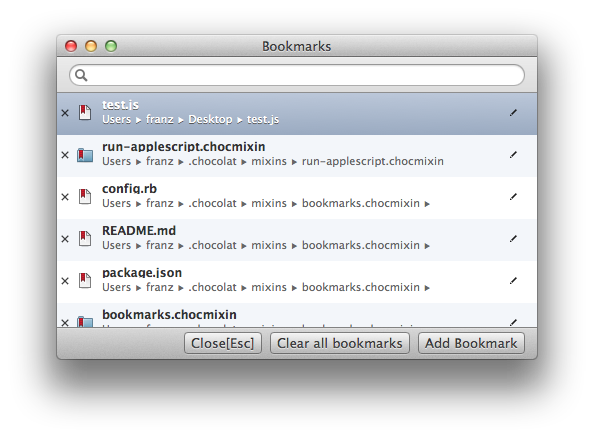

# bookmarks.chocmixin

A mixin for [Chocolat](http://www.chocolatapp.com) to bookmark files or directories for single click/keystroke access.

## Adding a bookmark
To bookmark your current document hit `alt-ctrl-b` or use `Go > Bookmarks > Add Bookmark`.
If the Bookmarks window is already open, you can alternatively click the `Add Bookmark` button.

## Opening a bookmark
Bring up the Bookmarks window by selecting `Go > Bookmarks > Show Bookmarks` or using `alt-cmd-ctrl-b`. Use the `Arrow Down` / `Arrow Up` keys to select the bookmark to open and double click or hit `Enter` to open it. Once a bookmark has been opened, the bookmarks window will close to get out of your way.

## Editing a bookmark, bookmarking directories
Click the Edit icon of the bookmark you want to edit:

To bookmark a directory, simply edit the path to point to a directory. There is unfortunately no way to directly bookmark a directory.
When you have edited a bookmark, the mixin will check for its type and validate it exists on disk.

---

###The MIT License (MIT)

Copyright (c) 2014 Franz Heidl

Permission is hereby granted, free of charge, to any person obtaining a copy
of this software and associated documentation files (the "Software"), to deal
in the Software without restriction, including without limitation the rights
to use, copy, modify, merge, publish, distribute, sublicense, and/or sell
copies of the Software, and to permit persons to whom the Software is
furnished to do so, subject to the following conditions:

The above copyright notice and this permission notice shall be included in
all copies or substantial portions of the Software.

THE SOFTWARE IS PROVIDED "AS IS", WITHOUT WARRANTY OF ANY KIND, EXPRESS OR
IMPLIED, INCLUDING BUT NOT LIMITED TO THE WARRANTIES OF MERCHANTABILITY,
FITNESS FOR A PARTICULAR PURPOSE AND NONINFRINGEMENT. IN NO EVENT SHALL THE
AUTHORS OR COPYRIGHT HOLDERS BE LIABLE FOR ANY CLAIM, DAMAGES OR OTHER
LIABILITY, WHETHER IN AN ACTION OF CONTRACT, TORT OR OTHERWISE, ARISING FROM,
OUT OF OR IN CONNECTION WITH THE SOFTWARE OR THE USE OR OTHER DEALINGS IN
THE SOFTWARE.

